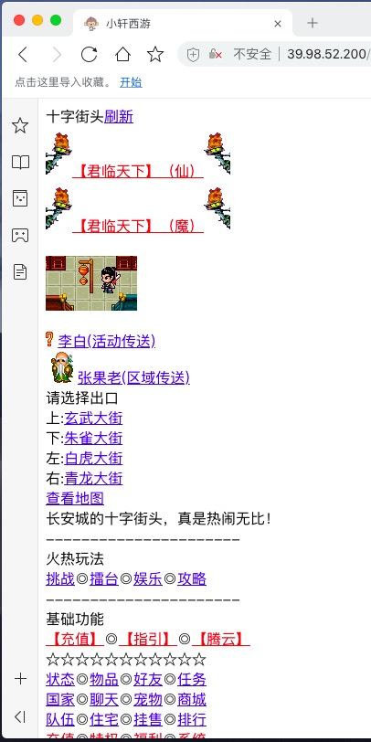

# 前言
幻想西游游戏源代码

## 技术栈
php + mysql

## 项目运行
1. 将index.php放到服务器目录
1. 数据库目录覆盖mysql的data目录，修改sql/mysql.php和fqxy/sql/mysql.php的数据库配置
1. 配置config/config.php目录下的host域名
1. 通过域名进行访问

## 运行环境
- php 5.6.40
- mysql 5.7.22

## 技术说明
- [文件缓存(缓存用户数据,格式类似json)](shuoming/ini.txt)

## 模块说明
- 地图
- 任务
- 附近玩家
- 拍卖行

## 游戏截图

